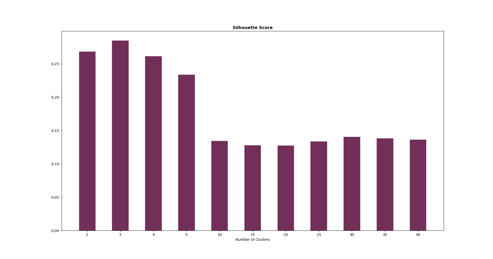
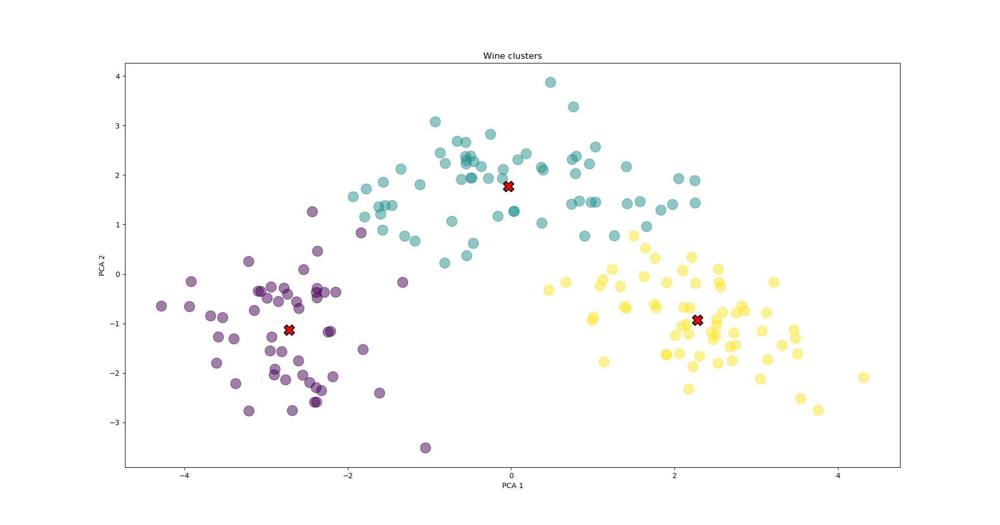

# Wine_Clustering_KMeans

This repo consists of a simple clustering of the famous Wine dataset's using K-means. There are total 13 attributes based on which the wines are grouped into different categories, hence Principal Component Analysis a.k.a PCA is used as a dimensionality reduction method and attributes are reduced to 2. This makes the visualization of the data pretty human-perceivable. 

### Dataset
[Wine dataset](https://www.kaggle.com/harrywang/wine-dataset-for-clustering) is taken from Kaggle. The type of wine information was removed so that it can be used for clustering. It contains total of 13 columns, the attributes on the basis of which each wine can be grouped. This information was collected for three different kind of wines, and our K-means algorithm was able to prove that. There are total 178 wine entry (rows 178)

### Environment
<pre><code>Ubuntu 20.0.4
Python 3.8.5
Numpy 1.19.4
Pandas 1.1.4
Matplotlib 3.1.2
</code></pre>

Hyper-parameter tuning (for the optinum number of clusters) is done on the basis of silhouette scores.

Final output after KMeans clustering 

